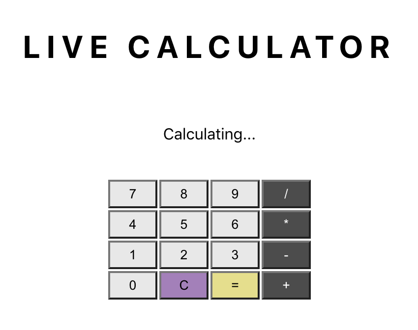

# Calculator Application with Live Updates

> 3 hour effort

I built a simple calculator applicaiton that delivers live updates when a user sumbits a calculation. The intention behind this project was to get familiar with WebSocket technology for more effective bi-directional communication. This will save time and effort compared to long-polling, heartbeats, and other http oriented methods. 

## Description

Basic calculator application which shows the most recent inputs by any user but also updates incoming calculations in real time. Application was spun up using create react-app and built out from there. 

## Technologies Used

- React
- Redux
- Sagas
- Node
- Express
- WebSockets
- PostgreSQL

## Installation & Deployment

- create a database named ```calculator_live```
- run the ```CREATE TABLE``` query found in ```database.sql``` to create the necessary data structure for this application.
- _This project was built using Postgres and I recommend having that installed to handle your DB._
- Open editor of choice and ```npm install``` for dependencies
- Open terminal and ```npm run server``` 
- Open second terminal and ```npm run client```
- The previous command will open a browser tab and have the project running for you!


## Usage

- Enter a simple calculation you would like to have solved
- Click the ```equals button``` to submit the equation and view the answer below
- To see the full functionality of this application open multiple instances of this project at once for real time updates whenever an equation is submitted. 

## Screenshots



